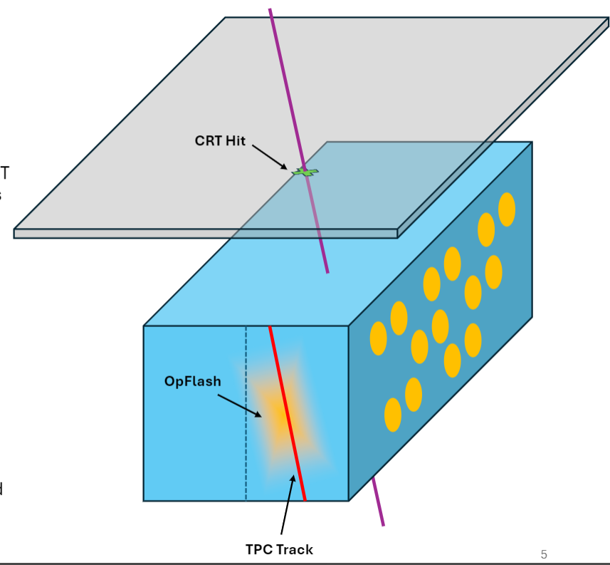
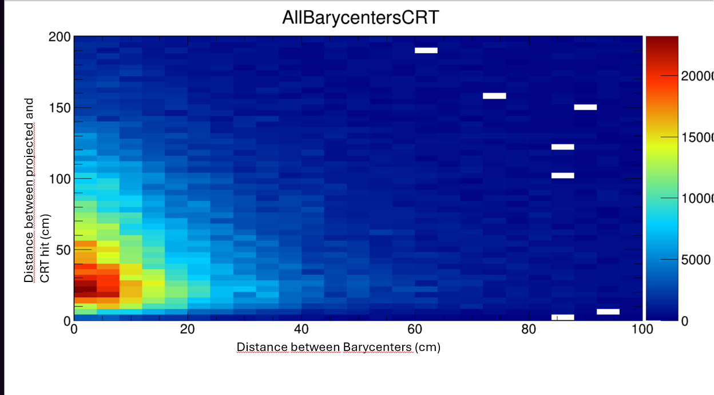
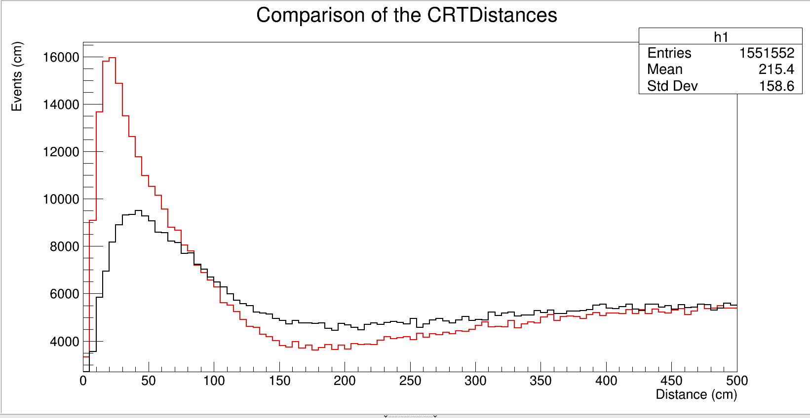

The ICARUS experiment is part of the Short Baseline Neutrino Program at Fermilab and is designed to test the sterile neutrino hypothesis with high precision. 
ICARUS is fed by Fermilab's NuMI and BNB muon neutrino beams, is fully operational and will collect a large amount of data looking for the oscillation of mu neutrinos into electronic ones.
It consists of three subdetectors:

1.	A cosmic ray tagger system (CRT) which marks incoming cosmic particles by a response in a series of scintillation bars located outside the detector volume.
2.	A time projection chamber (TPC), from which drifting ionizing particles are reconstructed by collecting the ionized gas electrons they have left along their path.
3.	A photomultiplier system (PMT) which triggers the data acquisition, collects the light emitted by the drifting ionized particles in the chamber and stores the time at which the interaction occurred.

The triple match is developed with the information coming from these 3 detectors. The first step takes the reconstructed data from each of the three subsystems. The reconstruction is centered on the TPC. 
However, it is not possible to obtain a direct time measurement from the TPC reconstruction, for which the PMT system is used, which sets the trigger signal and collects time information with an accuracy of the
order of nanoseconds. Meanwhile, outside the fiducial volume, the CRT system marks the time and the spatial position from which a given cosmic ray would enter the detector volume during data acquisition.
A reconstructed TPC track is paired with a flash based on the proximity of their barycenters, and from this pairing the time of the flash is inherited to the track. 
The reconstructed track is drifted along the new time and, as a quality check, the number of points still within the fiducial volume is counted. 
For those tracks that are still fully contained a projection is made onto the CRT plane and the coordinates of this projection are compared with the coordinates of the CRT hit reconstructed at the time of the 
flash (if any). The result of the algorithm is then a set of triples that contain a track paired with a given flash and CRT hit and for which there is an associated time.

Each triple contains the information of the distance of the barycenters and the crt HIT  from which the cut of a good match is performed or not. As a further step this triples are fed into a BDT 
that takes a montecarlo sample with true hits reconstructed and does a more refined selection.
In this project the triple-match and the first selection cut is showed.

The language in which the ICARUS data is handled and worked on is C, particulary ICARUS information is stored in a type of file named flat caf(https://github.com/cafana). The flat CAF is an special format designed to optimize
loops over events and calculate their oscillation probabilites. However as data is stored in them they can also serve to another type of analysis as cosmic background rejection. It was developed for NoVa
and its  principal output are histograms that are easy to handle. For more parallel analyses it is possible also to read from CAFAna into a txt file or a root file. The compiler of this CAF files is called CAFANA
the main object of CAFAna is called an spectrum, which acording to the CAFAana bibliography it is:

"The basic CAFAna histogram object is the Spectrum. This consists of a series of bin contents, internally
manipulated via Eigen, but available for display purposes as a ROOT histogram, plus associated exposure information (protons-on-target and/or livetime). 
Spectra provide a variety of mathematical operations and methods of combination, each of which takes proper account of the exposure information, essentially
eliminating proper scaling from the issues of concern to the user. Multi-dimensional spectra are supported
natively without adding significant complexity to the implementation. Internally they are flattened to one
dimension for all operations, and reconstituted for display." [1]
As another feature of Optimization, CAFAna does not compile all of the file at once but does it with only the types of variables called and relevant for the analysis,this using a  sub-package called SRProxy.
However this poses the difficulty of not being global, therefore needing to perform different loops instead of ones when calling different instances of the data saved in the CAF file. The triple match alogrithm
solved this issue by means of storing in vectors, or maps (depending on the type of call needed for the variable) that are called inside the principal instance and for which the informations are crossed then.

The structure of the code then takes the instances of the CRT and the PMT systems first and stores all of the information of interest for the match in vectors. These two are filled at the Standard Record
(the whole event) level. After this, the instance of the TPC track is called and a map is declared in which for each TPC track a pair of CRT,PMT signals is coupled and tested in terms of the closeness of the
TPC-PMT coordinates and the closennes of the projected track with the CRT that should correspond to the track by means of the common time of the detectors given by the flash.

The compilation of the code  takes a list of flatCAF icarus data files, performs the spectrum analysis (CAFANA is designed to perform a reading and storage of the variables of interest after cuts and conditionals and store the refined variable in an objcet called spectrum), and saved the other variables not casted into a spectrum into a root file using a txt file as an intermediate step. The choice of the txt instead of directly the root file is done because as CAFANA iterates over events,so creating new trees without declaring the root file messes up with the memory and gets segmentation fault. The resultant root file with the variables of interest is also uploaded.

The spectrum  takes the distance between the light and charge barycenters inside the TPC and the distance of  the projected CRT hit with respect to the measured CRT for the triples formed. The result is shown below:

From this plot we can see that the shorter the distance between the barycenters the more precise is also the projection on the CRT plane, indicating that the grouping of the 3 signals in the detector by means of the algorithm actually groups information that may correspond to the same particle event. In other words, it works :)

Additionaly from the ROOT tree a comparison between the distance between the projected hit onto the CRT and the actual CRT hit for the pandora reconstruction and the PCA is done and shown here in the next figure 

The graph shows that the PCA performs better in projecting th track, due to the fact that it takes all the points that make part of the tracks instead of the initial or end ones, as the pandora reoncstruction algorithm of ICARUS does, being more sensitive to multiple scattering. Is also worth noting that the peak
is not around 0 but around 20 cms, which also is in agreement with the offset on the detector. So again, the algorithm does good.

