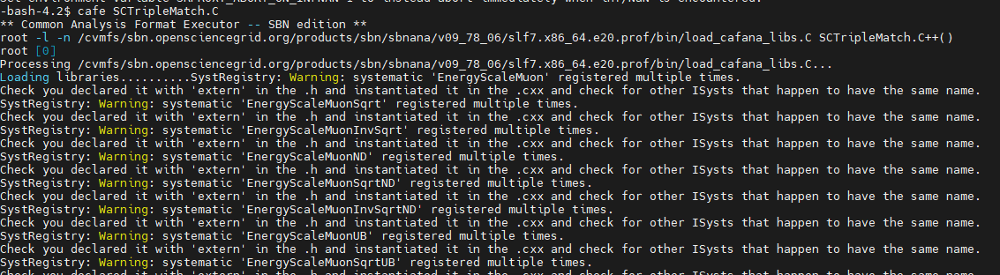

# SCNS
Software and computing for nuclear and subnuclear physics

#How to run the Code:
The machines of the CNAF have the possibility of installing CAFana on their files following the 
First time you set up a new version of sbnana (if allowed to gpfs_data, and maybe?,icaurs):
1. source  /cvmfs/icarus.opensciencegrid.org/products/icarus/setup_icarus.sh newmrb
2. setup   sbnana v09_78_06        -q      e20:prof
3. export  MRB_PROJECT=sbnana
4. source  /storage/gpfs_data/icarus/local/users/USERNAME/sbnana_v09_78_06/localProducts_sbnana_v09_78_06_e20_prof/setup (Here if you have access to an icarus folder,in any case i can pass and run it(?))
5. cd /storage/gpfs_data/icarus/local/users/USERNAME/sbnana_v09_78_06/srcs/
6. And here you can push this repo and do  cafe SCTripleMatch.C, the ouput is something like

 

The folder code contains SCTripleMatch.C, which is the C code that runs cafana, fills the spectrum of interest and saves the other variables into at xt that is converted into a root file (the txt is 107mb so i cant upload it here but here's the link along a bigger root https://liveunibo-my.sharepoint.com/personal/ricardo_jaimescampos_studio_unibo_it/_layouts/15/onedrive.aspx?id=%2Fpersonal%2Fricardo_jaimescampos_studio_unibo_it%2FDocuments%2FSC%20final%20root%20file&view=0) 

SCTripleMatch.h is where all the functions, structs and maps needed to group the values of the three ICARUS subdetectors are written, is organized from structs to functions to the actual implementation
DataList.txt contains the list of files from which the data was taken.

And the output root file is the result of the implementation of the code along the spectrum (saved inside the root file and in an image in ICARUS.md)

