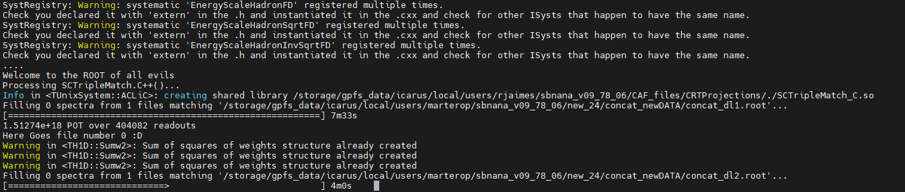

# SCNS
Software and computing for nuclear and subnuclear physics

#How to run the Code:
The machines of the CNAF have the possibility of installing CAFana on their files following the 
First time you set up a new version of sbnana (if allowed to gpfs_data, and maybe?,icaurs):
1. source  /cvmfs/icarus.opensciencegrid.org/products/icarus/setup_icarus.sh newmrb
2. setup   sbnana v09_78_06        -q      e20:prof
3. export  MRB_PROJECT=sbnana
4. source  /storage/gpfs_data/icarus/local/users/USERNAME/sbnana_v09_78_06/localProducts_sbnana_v09_78_06_e20_prof/setup (Here if you have access to an icarus folder,in any case i can pass and run it(?))
5. cd /storage/gpfs_data/icarus/local/users/USERNAME/sbnana_v09_78_06/srcs/
6. And here you can push this repo and do  cafe SCTripleMatch.C, the ouput is something like
7.  

